# 📊 Diagramas BiblioTech

> **Versión:** 1.0  
> **Sistema:** BiblioTech - Gestión de Biblioteca  
> **Última actualización:** Diciembre 2024  
> **Formato:** Mermaid (renderizado automático en GitHub)

---

## 📑 Tabla de Contenidos

- [1. Diagrama Entidad-Relación (ERD)](#1-diagrama-entidad-relación-erd)
- [2. Diagramas de Flujo de Procesos](#2-diagramas-de-flujo-de-procesos)
- [3. Diagramas UML de Clases](#3-diagramas-uml-de-clases)
- [4. Diagramas de Secuencia](#4-diagramas-de-secuencia)
- [5. Diagramas de Estados](#5-diagramas-de-estados)

---

## 1. Diagrama Entidad-Relación (ERD)

### 1.1 ERD Completo - Base de Datos BiblioTech

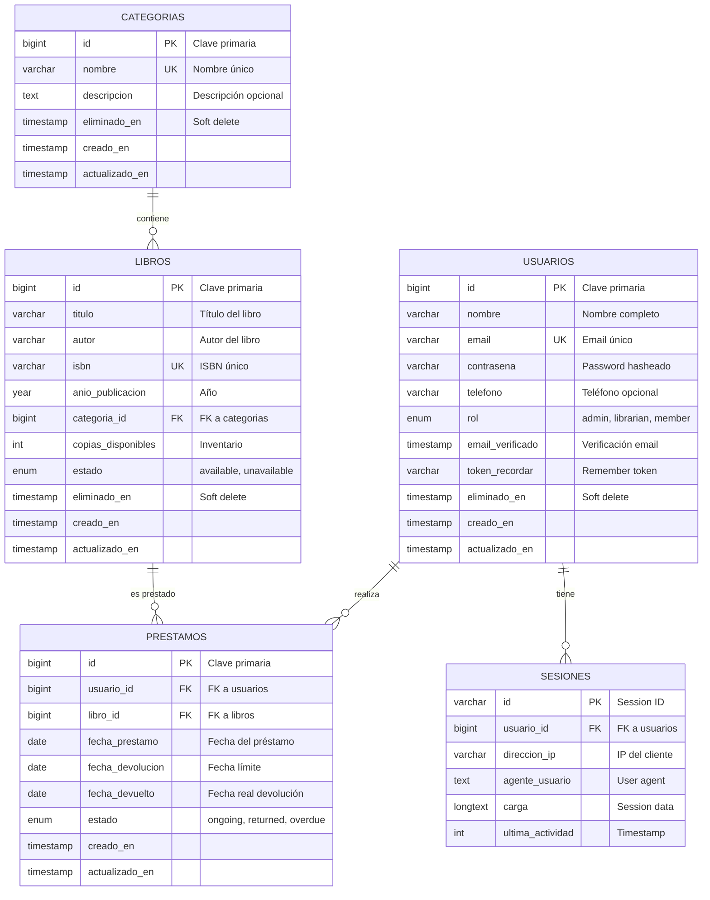

### 1.2 Restricciones y Relaciones Detalladas

| Tabla Origen | Columna | Tipo Restricción | Tabla Destino | Columna | Acción |
|--------------|---------|-------------------|---------------|---------|--------|
| LIBROS | categoria_id | FOREIGN KEY | CATEGORIAS | id | ON DELETE RESTRICT |
| PRESTAMOS | usuario_id | FOREIGN KEY | USUARIOS | id | ON DELETE RESTRICT |
| PRESTAMOS | libro_id | FOREIGN KEY | LIBROS | id | ON DELETE RESTRICT |
| SESIONES | usuario_id | FOREIGN KEY | USUARIOS | id | ON DELETE CASCADE |
| USUARIOS | email | UNIQUE | - | - | - |
| LIBROS | isbn | UNIQUE | - | - | - |
| CATEGORIAS | nombre | UNIQUE | - | - | - |

### 1.3 Índices de Base de Datos

```sql
-- Índices en tabla USUARIOS
CREATE UNIQUE INDEX idx_users_email ON users(email);
CREATE INDEX idx_users_role ON users(role);
CREATE INDEX idx_users_deleted_at ON users(deleted_at);

-- Índices en tabla LIBROS
CREATE UNIQUE INDEX idx_books_isbn ON books(isbn);
CREATE INDEX idx_books_category_id ON books(category_id);
CREATE INDEX idx_books_status ON books(status);
CREATE INDEX idx_books_deleted_at ON books(deleted_at);

-- Índices en tabla PRESTAMOS
CREATE INDEX idx_loans_user_id ON loans(user_id);
CREATE INDEX idx_loans_book_id ON loans(book_id);
CREATE INDEX idx_loans_status ON loans(status);
CREATE INDEX idx_loans_due_date ON loans(due_date);

-- Índices en tabla CATEGORIAS
CREATE UNIQUE INDEX idx_categories_name ON categories(name);
CREATE INDEX idx_categories_deleted_at ON categories(deleted_at);

-- Índices en tabla SESIONES
CREATE INDEX idx_sessions_user_id ON sessions(user_id);
CREATE INDEX idx_sessions_last_activity ON sessions(last_activity);
```

---

## 2. Diagramas de Flujo de Procesos

### 2.1 Proceso de Autenticación de Usuario

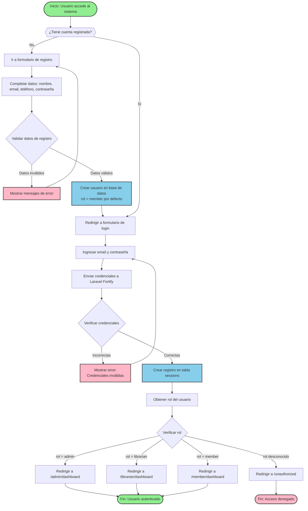

### 2.2 Proceso de Creación de Préstamo

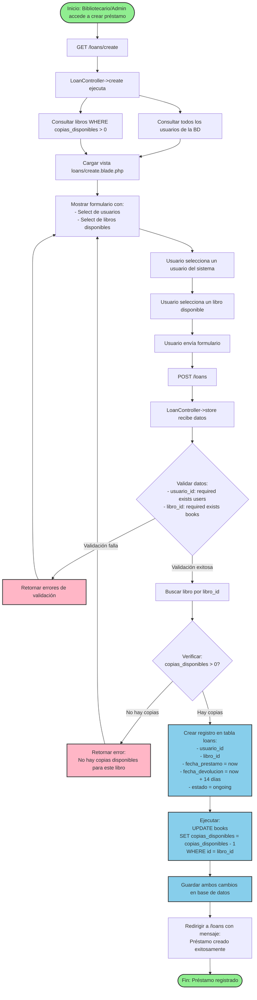

### 2.3 Proceso de Devolución de Libro

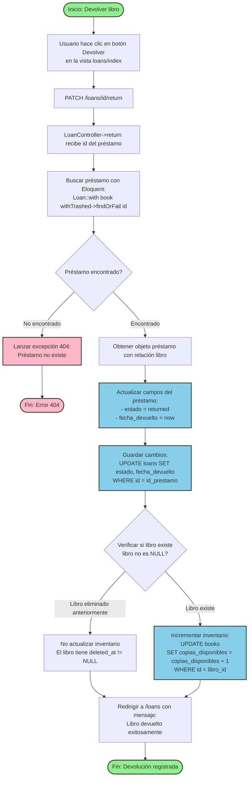

### 2.4 Proceso de Renovación de Préstamo

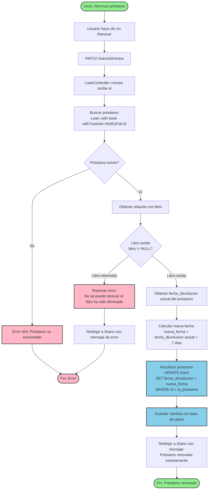

### 2.5 Proceso de Eliminación Suave (Soft Delete) de Libro

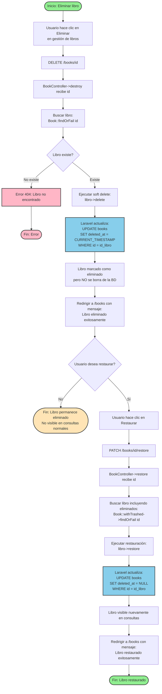

### 2.6 Flujo de Middleware de Roles (CheckRole)

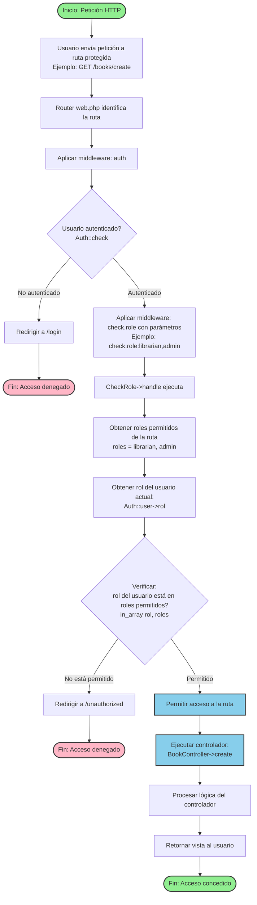

---

## 3. Diagramas UML de Clases

### 3.1 Diagrama de Clases - Modelos Eloquent

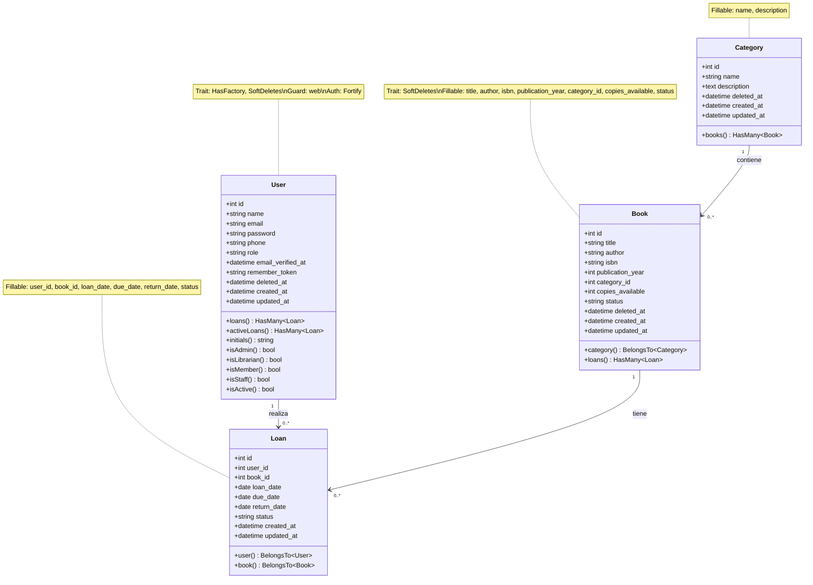

### 3.2 Diagrama de Clases - Controladores

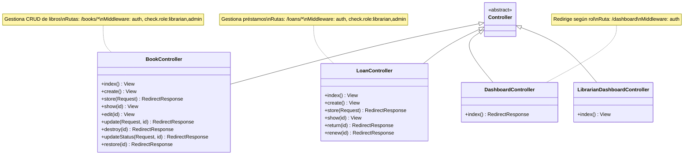

---

## 4. Diagramas de Secuencia

### 4.1 Secuencia: Crear Préstamo

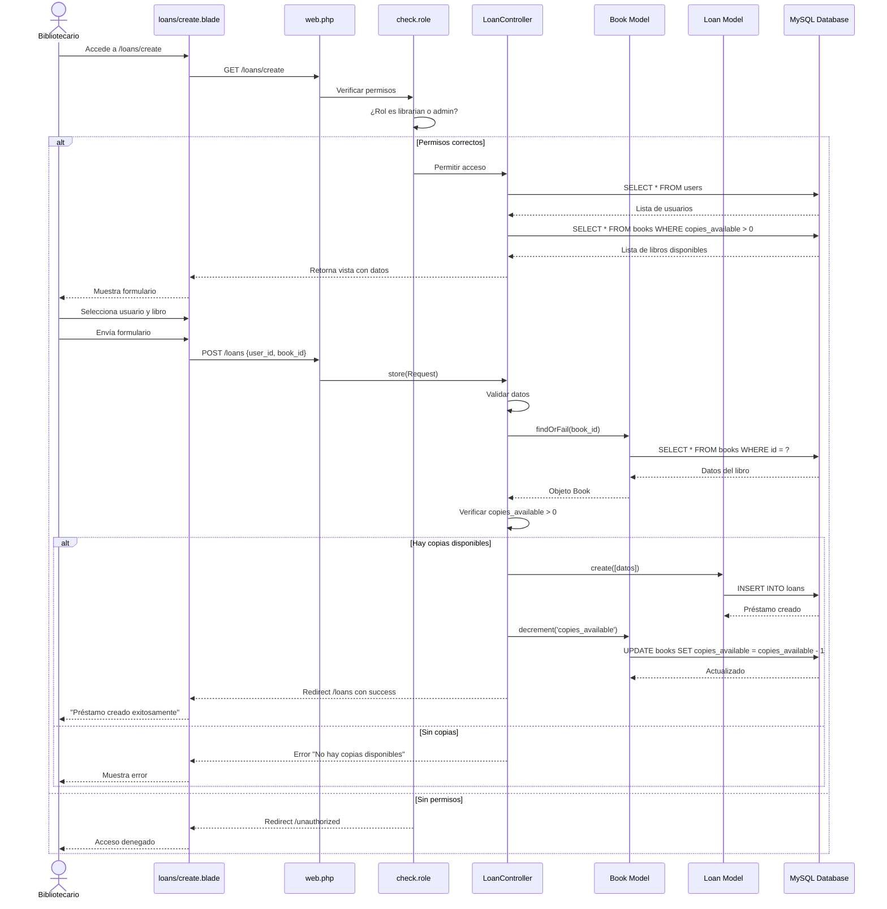

### 4.2 Secuencia: Autenticación con Laravel Fortify

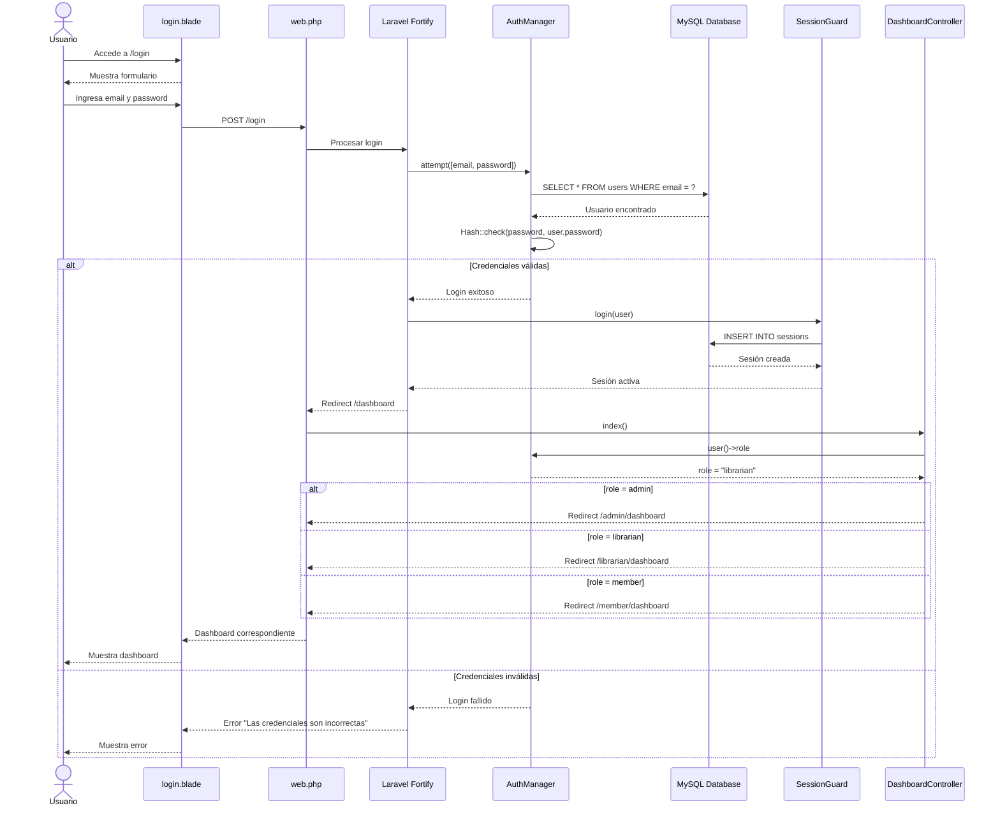

---

## 5. Diagramas de Estados

### 5.1 Estados de un Préstamo

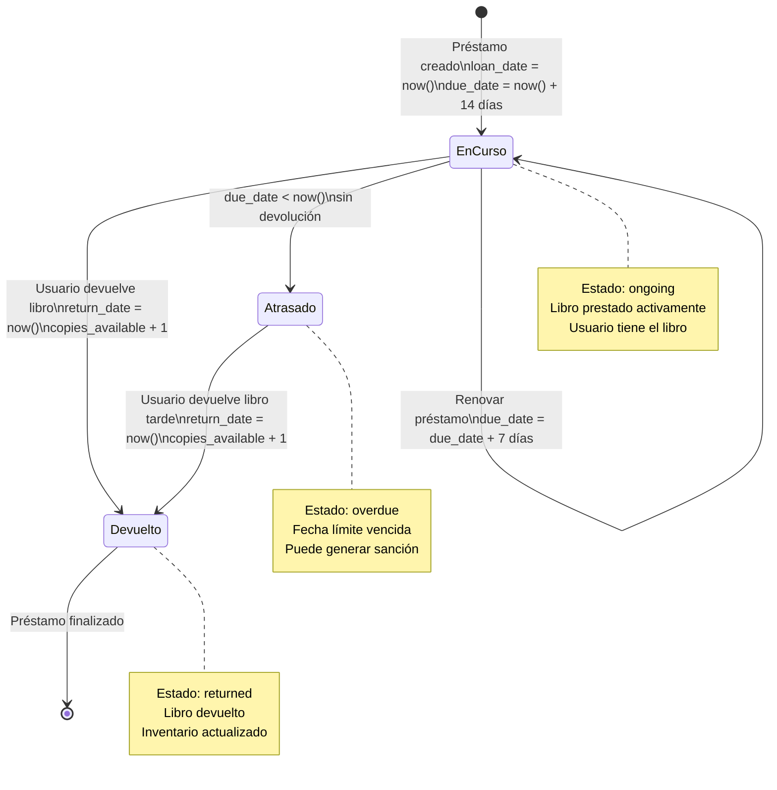

### 5.2 Estados de un Libro

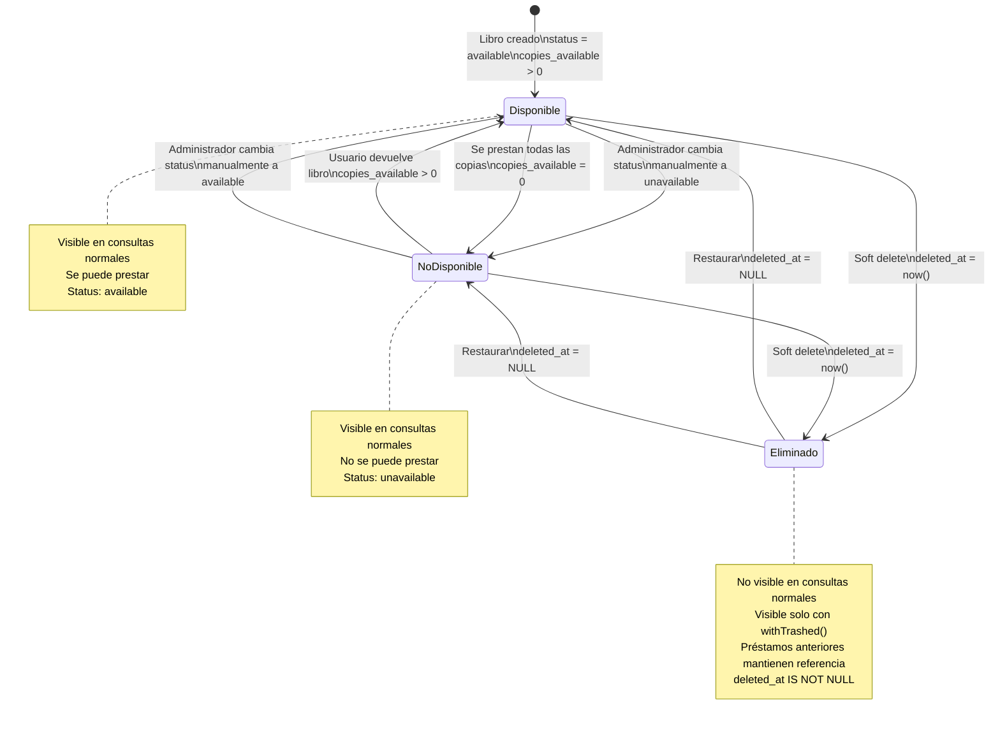

### 5.3 Ciclo de Vida de Usuario

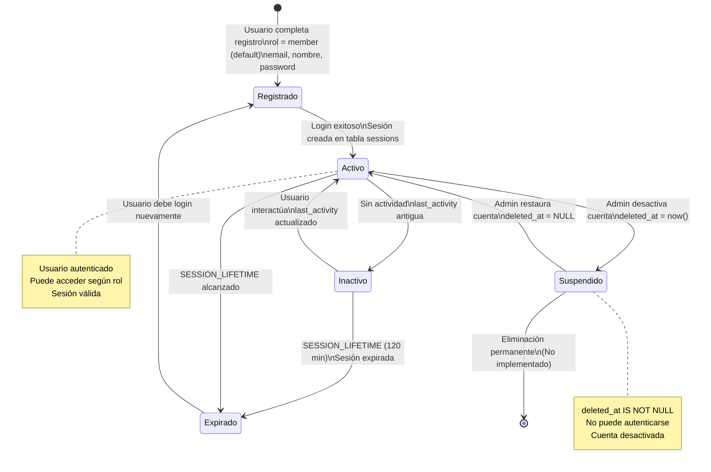

---

## 6. Leyenda de Colores y Símbolos

### 6.1 Colores en Diagramas de Flujo

| Color | Código | Significado |
|-------|--------|-------------|
| 🟢 Verde claro | `#90EE90` | Inicio / Fin de proceso |
| 🔵 Azul claro | `#87CEEB` | Operación / Proceso / Acción |
| 🔴 Rosa | `#FFB6C6` | Error / Fallo / Excepción |
| 🟡 Amarillo claro | `#FFE4B5` | Espera / Decisión / Advertencia |

### 6.2 Símbolos de Diagramas de Flujo

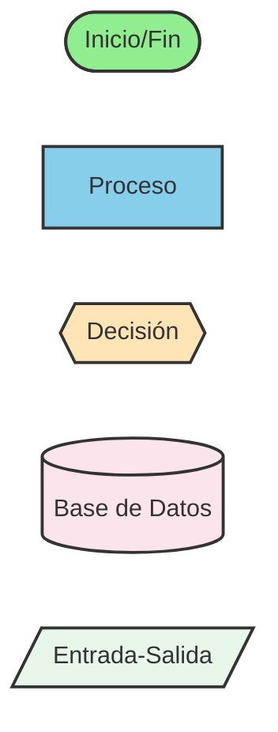

---

## 7. Notas Técnicas

### 7.1 Cómo Ver los Diagramas

Los diagramas en este archivo usan **sintaxis Mermaid** que GitHub renderiza automáticamente como imágenes cuando ves el archivo en el repositorio.

**Para verlos correctamente:**
1. Abre este archivo en GitHub (no en editor local)
2. Los diagramas se renderizarán como gráficos visuales
3. Si no se ven, actualiza la página

**Editores compatibles:**
- GitHub (renderizado automático)
- Visual Studio Code (con extensión Markdown Preview Mermaid Support)
- GitLab
- Notion
- Obsidian

### 7.2 Información Verificada

Todos los diagramas en este documento están basados en:
- Código real del repositorio BiblioTech rama `dev`
- Migraciones de base de datos existentes
- Modelos Eloquent implementados
- Controladores actuales
- Rutas definidas en `routes/web.php`

**No hay información inventada o supuesta.**

---

<div align="center">
  <p><strong>Diagramas BiblioTech v1.0</strong></p>
  <p>Todos los diagramas representan el estado actual del sistema</p>
  <p>Basado en código real de la rama dev</p>
  <p>© 2024 - Guillen Cristofer</p>
  <p>Generado: Diciembre 2024</p>
</div>
