# 📊 Diagramas BiblioTech

> **Versión:** 1.0  
> **Sistema:** BiblioTech - Gestión de Biblioteca  
> **Formato:** Mermaid (renderizado automático en GitHub)

---

## 📑 Tabla de Contenidos

1. [Diagrama Entidad-Relación (ERD)](#1-diagrama-entidad-relación-erd)
2. [Diagramas de Flujo](#2-diagramas-de-flujo)
3. [Diagramas UML](#3-diagramas-uml)
4. [Diagramas de Secuencia](#4-diagramas-de-secuencia)
5. [Diagramas de Estados](#5-diagramas-de-estados)

---

## 1. Diagrama Entidad-Relación (ERD)

### 1.1 ERD Completo del Sistema

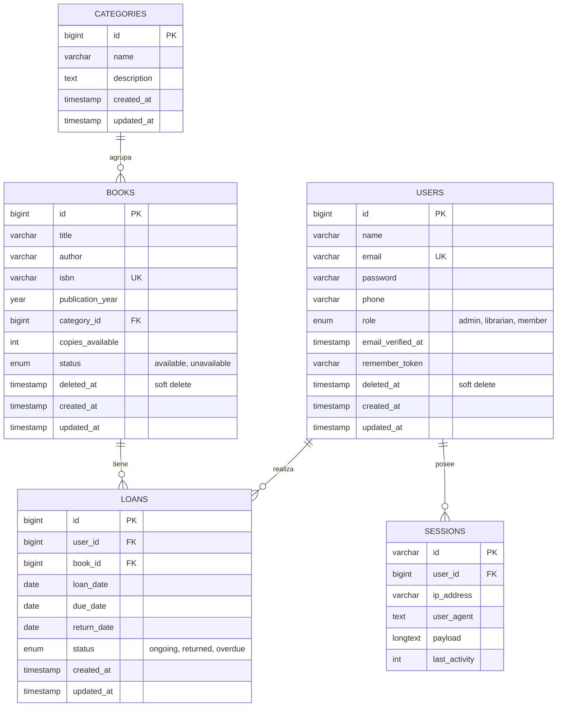
```mermaid
erDiagram
    USERS ||--o{ LOANS : "realiza"
    BOOKS ||--o{ LOANS : "tiene"
    CATEGORIES ||--o{ BOOKS : "agrupa"
    USERS ||--o{ SESSIONS : "posee"

    USERS {
        bigint id PK
        varchar name
        varchar email UK
        varchar password
        varchar phone
        enum role "admin, librarian, member"
        timestamp email_verified_at
        varchar remember_token
        timestamp deleted_at "soft delete"
        timestamp created_at
        timestamp updated_at
    }

    BOOKS {
        bigint id PK
        varchar title
        varchar author
        varchar isbn UK
        year publication_year
        bigint category_id FK
        int copies_available
        enum status "available, unavailable"
        timestamp deleted_at "soft delete"
        timestamp created_at
        timestamp updated_at
    }

    LOANS {
        bigint id PK
        bigint user_id FK
        bigint book_id FK
        date loan_date
        date due_date
        date return_date
        enum status "ongoing, returned, overdue"
        timestamp created_at
        timestamp updated_at
    }

    CATEGORIES {
        bigint id PK
        varchar name
        text description
        timestamp created_at
        timestamp updated_at
    }

    SESSIONS {
        varchar id PK
        bigint user_id FK
        varchar ip_address
        text user_agent
        longtext payload
        int last_activity
    }
```

### 1.2 Cardinalidades Detalladas

| Relación | Entidad Origen | Cardinalidad | Entidad Destino | Descripción |
|-----------|----------------|--------------|-----------------|-------------|
| realiza | USERS | 1:N | LOANS | Un usuario puede realizar muchos préstamos |
| tiene | BOOKS | 1:N | LOANS | Un libro puede tener muchos préstamos |
| agrupa | CATEGORIES | 1:N | BOOKS | Una categoría agrupa muchos libros |
| posee | USERS | 1:N | SESSIONS | Un usuario puede tener múltiples sesiones |

### 1.3 Restricciones de Integridad

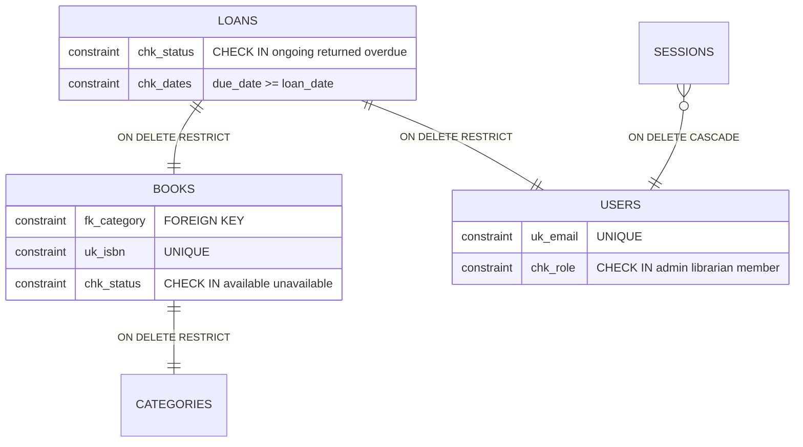
```mermaid
erDiagram
    BOOKS ||--|| CATEGORIES : "ON DELETE RESTRICT"
    LOANS ||--|| USERS : "ON DELETE RESTRICT"
    LOANS ||--|| BOOKS : "ON DELETE RESTRICT"
    SESSIONS }o--|| USERS : "ON DELETE CASCADE"

    BOOKS {
        constraint fk_category "FOREIGN KEY"
        constraint uk_isbn "UNIQUE"
        constraint chk_status "CHECK IN available unavailable"
    }

    USERS {
        constraint uk_email "UNIQUE"
        constraint chk_role "CHECK IN admin librarian member"
    }

    LOANS {
        constraint chk_status "CHECK IN ongoing returned overdue"
        constraint chk_dates "due_date >= loan_date"
    }
```

---

## 2. Diagramas de Flujo

### 2.1 Flujo de Autenticación y Autorización
```mermaid
flowchart TD
    Start([Usuario accede al sistema]) --> Login{{¿Tiene cuenta?}}
    Login -->|No| Register[Registrarse]
    Login -->|Sí| FormLogin[Ingresar email y contraseña]
    
    Register --> FormRegister[Completar formulario]
    FormRegister --> ValidateRegister{Validar datos}
    ValidateRegister -->|Inválido| ErrorRegister[Mostrar errores]
    ErrorRegister --> FormRegister
    ValidateRegister -->|Válido| CreateUser[Crear usuario con rol member]
    CreateUser --> FormLogin
    
    FormLogin --> ValidateLogin{Credenciales válidas?}
    ValidateLogin -->|No| ErrorLogin[Mostrar error]
    ErrorLogin --> FormLogin
    
    ValidateLogin -->|Sí| CreateSession[Crear sesión en DB]
    CreateSession --> CheckRole{Verificar rol}
    
    CheckRole -->|Admin| AdminDash[/admin/dashboard]
    CheckRole -->|Librarian| LibrarianDash[/librarian/dashboard]
    CheckRole -->|Member| MemberDash[/member/dashboard]
    CheckRole -->|Desconocido| Unauthorized[/unauthorized]
    
    AdminDash --> End([Usuario autenticado])
    LibrarianDash --> End
    MemberDash --> End
    Unauthorized --> End

    style Start fill:#90EE90
    style End fill:#90EE90
    style ErrorLogin fill:#FFB6C6
    style ErrorRegister fill:#FFB6C6
    style Unauthorized fill:#FFB6C6
    style CreateSession fill:#87CEEB
    style CheckRole fill:#87CEEB
```

### 2.2 Flujo de Creación de Préstamo

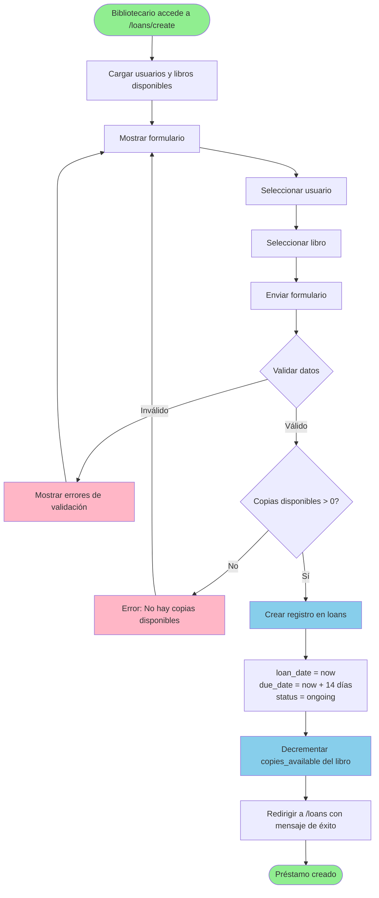
```mermaid
flowchart TD
    Start([Bibliotecario accede a /loans/create]) --> LoadData[Cargar usuarios y libros disponibles]
    LoadData --> DisplayForm[Mostrar formulario]
    
    DisplayForm --> SelectUser[Seleccionar usuario]
    SelectUser --> SelectBook[Seleccionar libro]
    SelectBook --> Submit[Enviar formulario]
    
    Submit --> ValidateForm{Validar datos}
    ValidateForm -->|Inválido| ShowErrors[Mostrar errores de validación]
    ShowErrors --> DisplayForm
    
    ValidateForm -->|Válido| CheckCopies{Copias disponibles > 0?}
    CheckCopies -->|No| ErrorNoCopies[Error: No hay copias disponibles]
    ErrorNoCopies --> DisplayForm
    
    CheckCopies -->|Sí| CreateLoan[Crear registro en loans]
    CreateLoan --> SetDates[loan_date = now<br/>due_date = now + 14 días<br/>status = ongoing]
    SetDates --> DecrementCopies[Decrementar copies_available del libro]
    DecrementCopies --> Success[Redirigir a /loans con mensaje de éxito]
    
    Success --> End([Préstamo creado])

    style Start fill:#90EE90
    style End fill:#90EE90
    style ErrorNoCopies fill:#FFB6C6
    style ShowErrors fill:#FFB6C6
    style CreateLoan fill:#87CEEB
    style DecrementCopies fill:#87CEEB
```

### 2.3 Flujo de Devolución de Libro

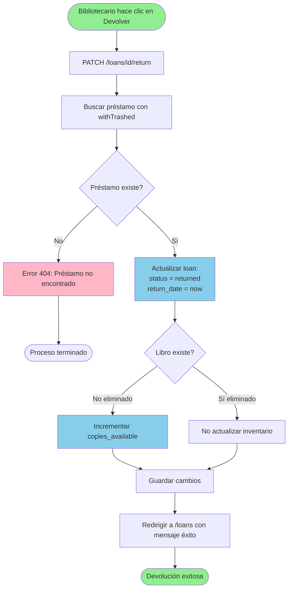
```mermaid
flowchart TD
    Start([Bibliotecario hace clic en Devolver]) --> GetLoan[PATCH /loans/id/return]
    GetLoan --> FindLoan[Buscar préstamo con withTrashed]
    
    FindLoan --> LoanExists{Préstamo existe?}
    LoanExists -->|No| Error404[Error 404: Préstamo no encontrado]
    Error404 --> End([Proceso terminado])
    
    LoanExists -->|Sí| UpdateStatus[Actualizar loan:<br/>status = returned<br/>return_date = now]
    UpdateStatus --> BookExists{Libro existe?}
    
    BookExists -->|No eliminado| IncrementCopies[Incrementar copies_available]
    BookExists -->|Sí eliminado| SkipIncrement[No actualizar inventario]
    
    IncrementCopies --> SaveChanges[Guardar cambios]
    SkipIncrement --> SaveChanges
    SaveChanges --> Success[Redirigir a /loans con mensaje éxito]
    Success --> EndSuccess([Devolución exitosa])

    style Start fill:#90EE90
    style EndSuccess fill:#90EE90
    style Error404 fill:#FFB6C6
    style UpdateStatus fill:#87CEEB
    style IncrementCopies fill:#87CEEB
```

### 2.4 Flujo de Renovación de Préstamo

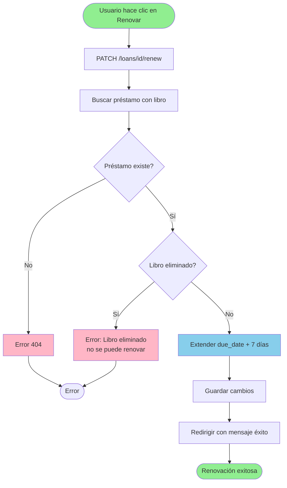
```mermaid
flowchart TD
    Start([Usuario hace clic en Renovar]) --> GetLoan[PATCH /loans/id/renew]
    GetLoan --> FindLoan[Buscar préstamo con libro]
    
    FindLoan --> LoanExists{Préstamo existe?}
    LoanExists -->|No| Error404[Error 404]
    Error404 --> End([Error])
    
    LoanExists -->|Sí| BookDeleted{Libro eliminado?}
    BookDeleted -->|Sí| ErrorDeleted[Error: Libro eliminado<br/>no se puede renovar]
    ErrorDeleted --> End
    
    BookDeleted -->|No| ExtendDate[Extender due_date + 7 días]
    ExtendDate --> Save[Guardar cambios]
    Save --> Success[Redirigir con mensaje éxito]
    Success --> EndSuccess([Renovación exitosa])

    style Start fill:#90EE90
    style EndSuccess fill:#90EE90
    style Error404 fill:#FFB6C6
    style ErrorDeleted fill:#FFB6C6
    style ExtendDate fill:#87CEEB
```

### 2.5 Flujo de Soft Delete y Restauración

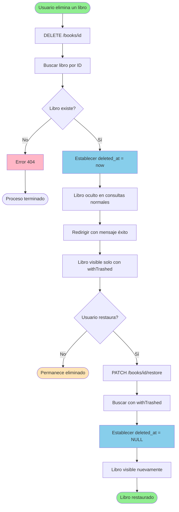
```mermaid
flowchart TD
    Start([Usuario elimina un libro]) --> DeleteRequest[DELETE /books/id]
    DeleteRequest --> FindBook[Buscar libro por ID]
    
    FindBook --> BookExists{Libro existe?}
    BookExists -->|No| Error404[Error 404]
    Error404 --> End([Proceso terminado])
    
    BookExists -->|Sí| SoftDelete[Establecer deleted_at = now]
    SoftDelete --> HideFromQueries[Libro oculto en consultas normales]
    HideFromQueries --> SuccessDelete[Redirigir con mensaje éxito]
    SuccessDelete --> ShowTrashed[Libro visible solo con withTrashed]
    
    ShowTrashed --> RestoreAction{Usuario restaura?}
    RestoreAction -->|No| StayDeleted([Permanece eliminado])
    RestoreAction -->|Sí| RestoreRequest[PATCH /books/id/restore]
    
    RestoreRequest --> FindTrashed[Buscar con withTrashed]
    FindTrashed --> SetNull[Establecer deleted_at = NULL]
    SetNull --> VisibleAgain[Libro visible nuevamente]
    VisibleAgain --> EndRestore([Libro restaurado])

    style Start fill:#90EE90
    style EndRestore fill:#90EE90
    style StayDeleted fill:#FFE4B5
    style Error404 fill:#FFB6C6
    style SoftDelete fill:#87CEEB
    style SetNull fill:#87CEEB
```

### 2.6 Flujo del Middleware CheckRole

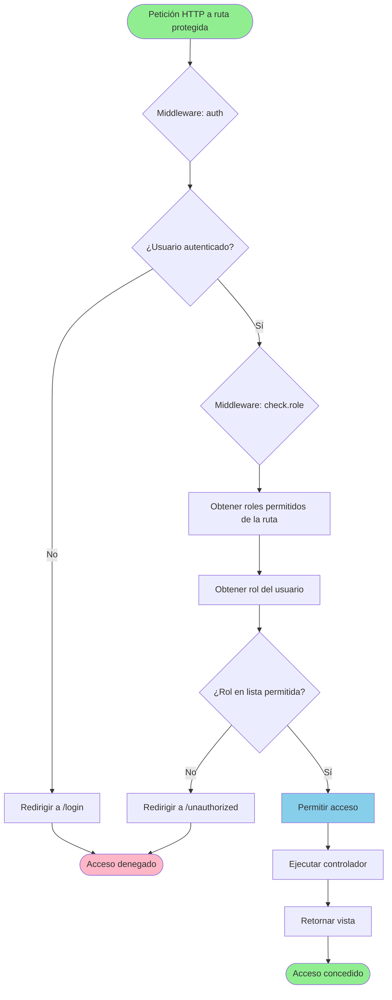
```mermaid
flowchart TD
    Start([Petición HTTP a ruta protegida]) --> MiddlewareAuth{Middleware: auth}
    
    MiddlewareAuth --> IsAuthenticated{¿Usuario autenticado?}
    IsAuthenticated -->|No| RedirectLogin[Redirigir a /login]
    RedirectLogin --> End([Acceso denegado])
    
    IsAuthenticated -->|Sí| MiddlewareRole{Middleware: check.role}
    MiddlewareRole --> GetRoles[Obtener roles permitidos de la ruta]
    GetRoles --> GetUserRole[Obtener rol del usuario]
    
    GetUserRole --> CheckRole{¿Rol en lista permitida?}
    CheckRole -->|No| RedirectUnauth[Redirigir a /unauthorized]
    RedirectUnauth --> End
    
    CheckRole -->|Sí| AllowAccess[Permitir acceso]
    AllowAccess --> ExecuteController[Ejecutar controlador]
    ExecuteController --> ReturnView[Retornar vista]
    ReturnView --> EndSuccess([Acceso concedido])

    style Start fill:#90EE90
    style EndSuccess fill:#90EE90
    style End fill:#FFB6C6
    style AllowAccess fill:#87CEEB
```

---

## 3. Diagramas UML

### 3.1 Diagrama de Clases (Modelos Eloquent)

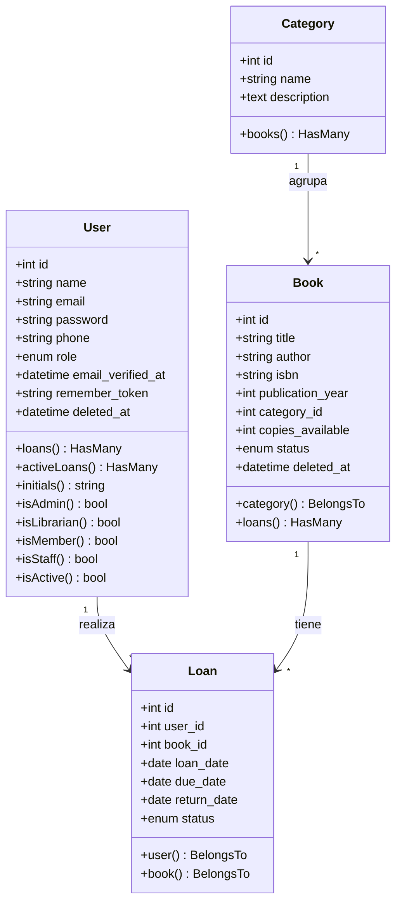
```mermaid
classDiagram
    class User {
        +int id
        +string name
        +string email
        +string password
        +string phone
        +enum role
        +datetime email_verified_at
        +string remember_token
        +datetime deleted_at
        +loans() HasMany
        +activeLoans() HasMany
        +initials() string
        +isAdmin() bool
        +isLibrarian() bool
        +isMember() bool
        +isStaff() bool
        +isActive() bool
    }

    class Book {
        +int id
        +string title
        +string author
        +string isbn
        +int publication_year
        +int category_id
        +int copies_available
        +enum status
        +datetime deleted_at
        +category() BelongsTo
        +loans() HasMany
    }

    class Loan {
        +int id
        +int user_id
        +int book_id
        +date loan_date
        +date due_date
        +date return_date
        +enum status
        +user() BelongsTo
        +book() BelongsTo
    }

    class Category {
        +int id
        +string name
        +text description
        +books() HasMany
    }

    User "1" --> "*" Loan : realiza
    Book "1" --> "*" Loan : tiene
    Category "1" --> "*" Book : agrupa
```

### 3.2 Diagrama de Componentes

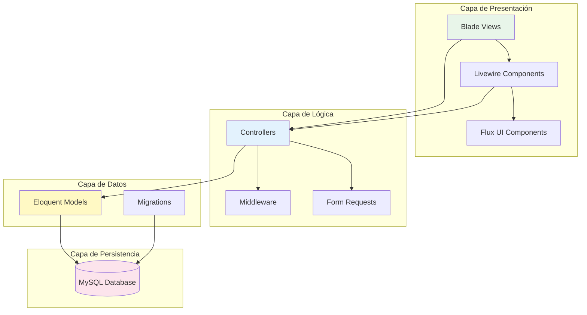
```mermaid
graph TB
    subgraph "Capa de Presentación"
        Views[Blade Views]
        Livewire[Livewire Components]
        Flux[Flux UI Components]
    end

    subgraph "Capa de Lógica"
        Controllers[Controllers]
        Middleware[Middleware]
        Requests[Form Requests]
    end

    subgraph "Capa de Datos"
        Models[Eloquent Models]
        Migrations[Migrations]
    end

    subgraph "Capa de Persistencia"
        Database[(MySQL Database)]
    end

    Views --> Livewire
    Livewire --> Flux
    Views --> Controllers
    Livewire --> Controllers
    
    Controllers --> Middleware
    Controllers --> Requests
    Controllers --> Models
    
    Models --> Database
    Migrations --> Database

    style Views fill:#E8F5E9
    style Controllers fill:#E3F2FD
    style Models fill:#FFF9C4
    style Database fill:#FCE4EC
```

### 3.3 Diagrama de Paquetes

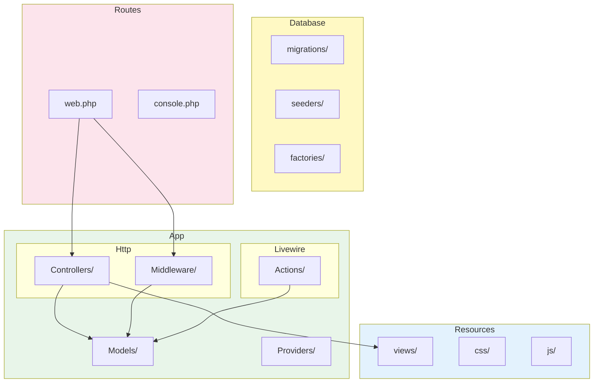
```mermaid
graph TB
    subgraph App
        subgraph Http
            Controllers[Controllers/]
            Middleware[Middleware/]
        end
        
        subgraph Livewire
            Components[Actions/]
        end
        
        Models[Models/]
        Providers[Providers/]
    end

    subgraph Resources
        Views[views/]
        CSS[css/]
        JS[js/]
    end

    subgraph Database
        Migrations[migrations/]
        Seeders[seeders/]
        Factories[factories/]
    end

    subgraph Routes
        Web[web.php]
        Console[console.php]
    end

    Controllers --> Models
    Middleware --> Models
    Components --> Models
    Controllers --> Views
    Web --> Controllers
    Web --> Middleware

    style App fill:#E8F5E9
    style Resources fill:#E3F2FD
    style Database fill:#FFF9C4
    style Routes fill:#FCE4EC
```

---

## 4. Diagramas de Secuencia

### 4.1 Secuencia de Creación de Préstamo

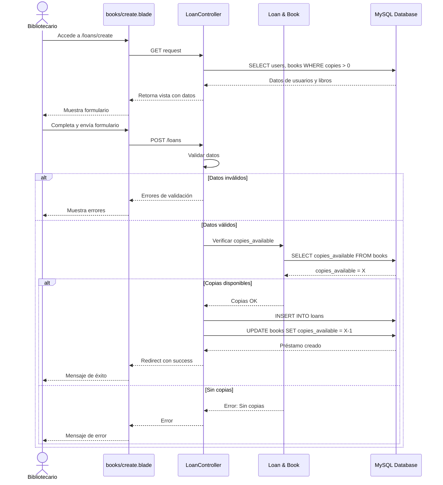
```mermaid
sequenceDiagram
    actor Bibliotecario
    participant Vista as books/create.blade
    participant Controller as LoanController
    participant Model as Loan & Book
    participant DB as MySQL Database

    Bibliotecario->>Vista: Accede a /loans/create
    Vista->>Controller: GET request
    Controller->>DB: SELECT users, books WHERE copies > 0
    DB-->>Controller: Datos de usuarios y libros
    Controller-->>Vista: Retorna vista con datos
    Vista-->>Bibliotecario: Muestra formulario

    Bibliotecario->>Vista: Completa y envía formulario
    Vista->>Controller: POST /loans
    Controller->>Controller: Validar datos
    
    alt Datos inválidos
        Controller-->>Vista: Errores de validación
        Vista-->>Bibliotecario: Muestra errores
    else Datos válidos
        Controller->>Model: Verificar copies_available
        Model->>DB: SELECT copies_available FROM books
        DB-->>Model: copies_available = X
        
        alt Copias disponibles
            Model-->>Controller: Copias OK
            Controller->>DB: INSERT INTO loans
            Controller->>DB: UPDATE books SET copies_available = X-1
            DB-->>Controller: Préstamo creado
            Controller-->>Vista: Redirect con success
            Vista-->>Bibliotecario: Mensaje de éxito
        else Sin copias
            Model-->>Controller: Error: Sin copias
            Controller-->>Vista: Error
            Vista-->>Bibliotecario: Mensaje de error
        end
    end
```

### 4.2 Secuencia de Autenticación

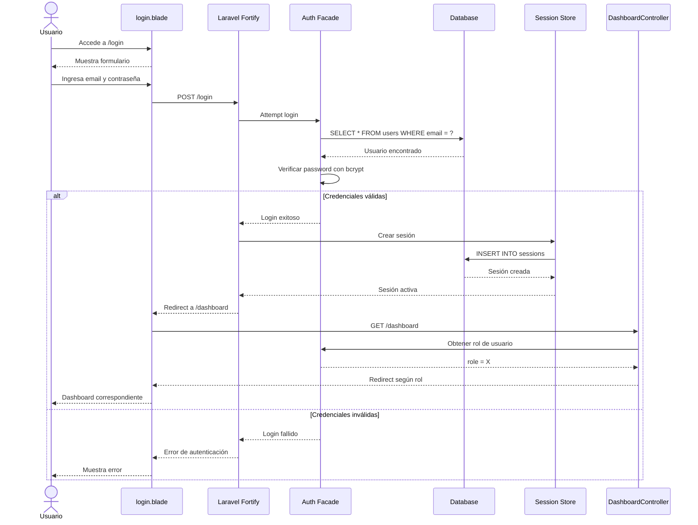
```mermaid
sequenceDiagram
    actor Usuario
    participant Vista as login.blade
    participant Fortify as Laravel Fortify
    participant Auth as Auth Facade
    participant DB as Database
    participant Session as Session Store

    Usuario->>Vista: Accede a /login
    Vista-->>Usuario: Muestra formulario

    Usuario->>Vista: Ingresa email y contraseña
    Vista->>Fortify: POST /login
    Fortify->>Auth: Attempt login
    Auth->>DB: SELECT * FROM users WHERE email = ?
    DB-->>Auth: Usuario encontrado
    
    Auth->>Auth: Verificar password con bcrypt
    
    alt Credenciales válidas
        Auth-->>Fortify: Login exitoso
        Fortify->>Session: Crear sesión
        Session->>DB: INSERT INTO sessions
        DB-->>Session: Sesión creada
        Session-->>Fortify: Sesión activa
        Fortify-->>Vista: Redirect a /dashboard
        Vista->>DashboardController: GET /dashboard
        DashboardController->>Auth: Obtener rol de usuario
        Auth-->>DashboardController: role = X
        DashboardController-->>Vista: Redirect según rol
        Vista-->>Usuario: Dashboard correspondiente
    else Credenciales inválidas
        Auth-->>Fortify: Login fallido
        Fortify-->>Vista: Error de autenticación
        Vista-->>Usuario: Muestra error
    end
```

### 4.3 Secuencia de Devolución con Libro Eliminado

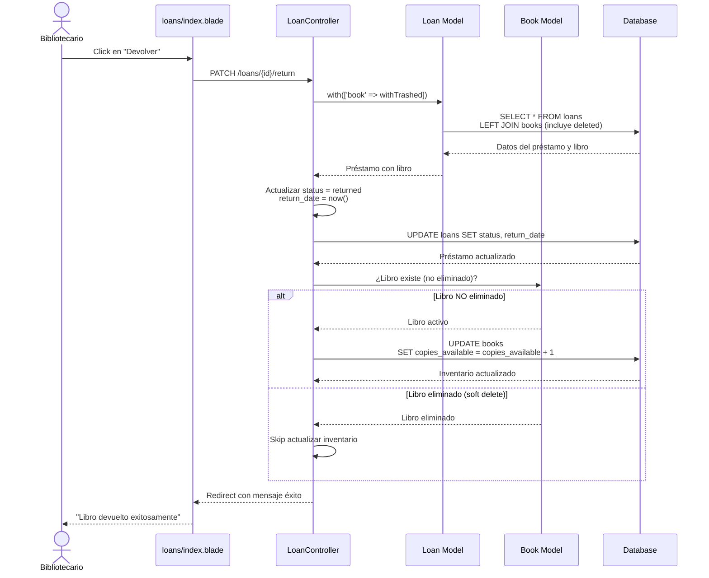
```mermaid
sequenceDiagram
    actor Bibliotecario
    participant Vista as loans/index.blade
    participant Controller as LoanController
    participant Loan as Loan Model
    participant Book as Book Model
    participant DB as Database

    Bibliotecario->>Vista: Click en "Devolver"
    Vista->>Controller: PATCH /loans/{id}/return
    
    Controller->>Loan: with(['book' => withTrashed])
    Loan->>DB: SELECT * FROM loans<br/>LEFT JOIN books (incluye deleted)
    DB-->>Loan: Datos del préstamo y libro
    Loan-->>Controller: Préstamo con libro

    Controller->>Controller: Actualizar status = returned<br/>return_date = now()
    Controller->>DB: UPDATE loans SET status, return_date
    DB-->>Controller: Préstamo actualizado

    Controller->>Book: ¿Libro existe (no eliminado)?
    
    alt Libro NO eliminado
        Book-->>Controller: Libro activo
        Controller->>DB: UPDATE books<br/>SET copies_available = copies_available + 1
        DB-->>Controller: Inventario actualizado
    else Libro eliminado (soft delete)
        Book-->>Controller: Libro eliminado
        Controller->>Controller: Skip actualizar inventario
    end

    Controller-->>Vista: Redirect con mensaje éxito
    Vista-->>Bibliotecario: "Libro devuelto exitosamente"
```

---

## 5. Diagramas de Estados

### 5.1 Estados de un Préstamo (Loan)

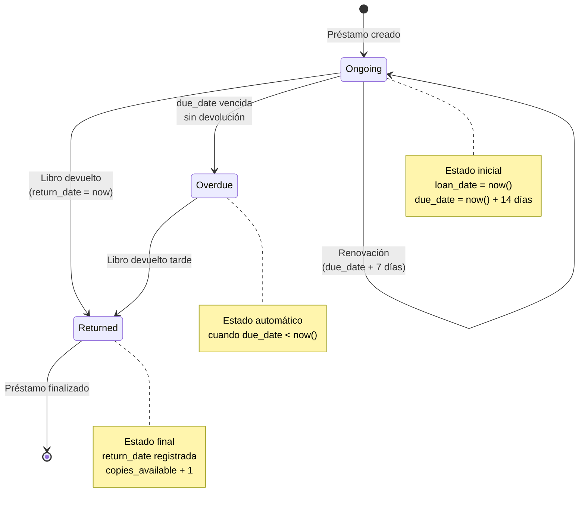
```mermaid
stateDiagram-v2
    [*] --> Ongoing: Préstamo creado
    
    Ongoing --> Returned: Libro devuelto<br/>(return_date = now)
    Ongoing --> Overdue: due_date vencida<br/>sin devolución
    Overdue --> Returned: Libro devuelto tarde
    
    Ongoing --> Ongoing: Renovación<br/>(due_date + 7 días)
    
    Returned --> [*]: Préstamo finalizado

    note right of Ongoing
        Estado inicial
        loan_date = now()
        due_date = now() + 14 días
    end note

    note right of Overdue
        Estado automático
        cuando due_date < now()
    end note

    note right of Returned
        Estado final
        return_date registrada
        copies_available + 1
    end note
```

### 5.2 Estados de un Libro (Book)

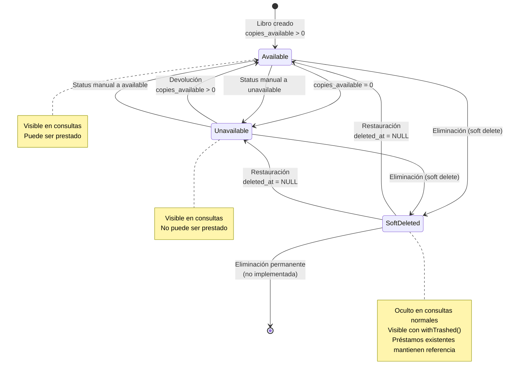
```mermaid
stateDiagram-v2
    [*] --> Available: Libro creado<br/>copies_available > 0
    
    Available --> Unavailable: copies_available = 0
    Available --> Unavailable: Status manual a unavailable
    
    Unavailable --> Available: Devolución<br/>copies_available > 0
    Unavailable --> Available: Status manual a available
    
    Available --> SoftDeleted: Eliminación (soft delete)
    Unavailable --> SoftDeleted: Eliminación (soft delete)
    
    SoftDeleted --> Available: Restauración<br/>deleted_at = NULL
    SoftDeleted --> Unavailable: Restauración<br/>deleted_at = NULL
    
    SoftDeleted --> [*]: Eliminación permanente<br/>(no implementada)

    note right of Available
        Visible en consultas
        Puede ser prestado
    end note

    note right of Unavailable
        Visible en consultas
        No puede ser prestado
    end note

    note right of SoftDeleted
        Oculto en consultas normales
        Visible con withTrashed()
        Préstamos existentes mantienen referencia
    end note
```

### 5.3 Estados de una Sesión de Usuario

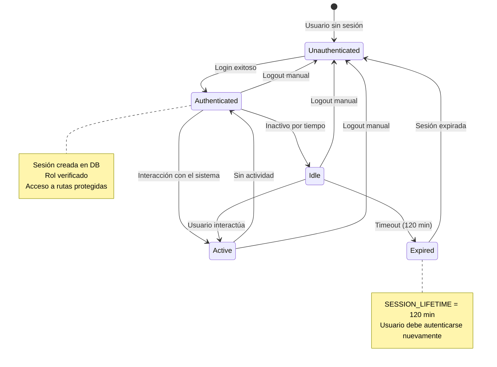
```mermaid
stateDiagram-v2
    [*] --> Unauthenticated: Usuario sin sesión
    
    Unauthenticated --> Authenticated: Login exitoso
    
    Authenticated --> Active: Interacción con el sistema
    Active --> Authenticated: Sin actividad
    
    Authenticated --> Idle: Inactivo por tiempo
    Idle --> Active: Usuario interactúa
    Idle --> Expired: Timeout (120 min)
    
    Authenticated --> Unauthenticated: Logout manual
    Active --> Unauthenticated: Logout manual
    Idle --> Unauthenticated: Logout manual
    Expired --> Unauthenticated: Sesión expirada

    note right of Authenticated
        Sesión creada en DB
        Rol verificado
        Acceso a rutas protegidas
    end note

    note right of Expired
        SESSION_LIFETIME = 120 min
        Usuario debe autenticarse nuevamente
    end note
```

### 5.4 Ciclo de Vida de un Usuario

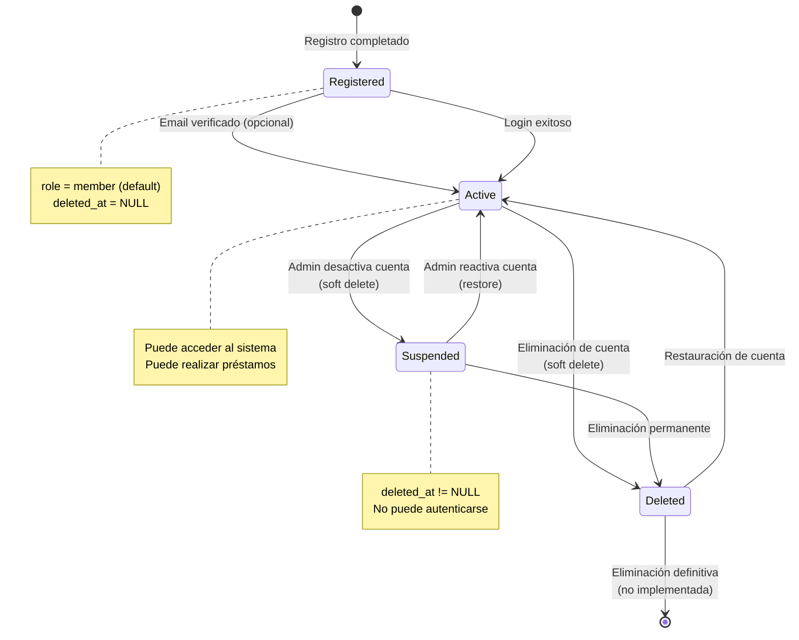
```mermaid
stateDiagram-v2
    [*] --> Registered: Registro completado
    
    Registered --> Active: Email verificado (opcional)
    Registered --> Active: Login exitoso
    
    Active --> Suspended: Admin desactiva cuenta<br/>(soft delete)
    Suspended --> Active: Admin reactiva cuenta<br/>(restore)
    
    Active --> Deleted: Eliminación de cuenta<br/>(soft delete)
    Suspended --> Deleted: Eliminación permanente
    
    Deleted --> Active: Restauración de cuenta
    
    Deleted --> [*]: Eliminación definitiva<br/>(no implementada)

    note right of Registered
        role = member (default)
        deleted_at = NULL
    end note

    note right of Active
        Puede acceder al sistema
        Puede realizar préstamos
    end note

    note right of Suspended
        deleted_at != NULL
        No puede autenticarse
    end note
```

---

## 6. Diagrama de Arquitectura de Alto Nivel

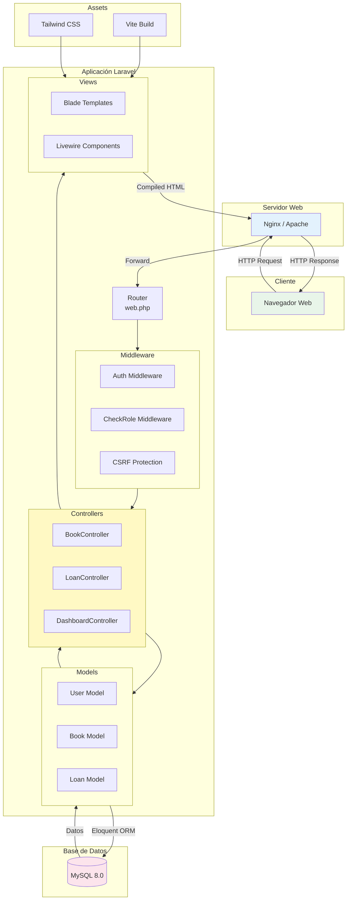
```mermaid
graph TB
    subgraph Cliente
        Browser[Navegador Web]
    end

    subgraph "Servidor Web"
        Nginx[Nginx / Apache]
    end

    subgraph "Aplicación Laravel"
        Router[Router<br/>web.php]
        
        subgraph Middleware
            Auth[Auth Middleware]
            CheckRole[CheckRole Middleware]
            CSRF[CSRF Protection]
        end
        
        subgraph Controllers
            BookCtrl[BookController]
            LoanCtrl[LoanController]
            DashCtrl[DashboardController]
        end
        
        subgraph Models
            User[User Model]
            Book[Book Model]
            Loan[Loan Model]
        end
        
        subgraph Views
            Blade[Blade Templates]
            Livewire[Livewire Components]
        end
    end

    subgraph "Base de Datos"
        MySQL[(MySQL 8.0)]
    end

    subgraph "Assets"
        Vite[Vite Build]
        Tailwind[Tailwind CSS]
    end

    Browser -->|HTTP Request| Nginx
    Nginx -->|Forward| Router
    Router --> Middleware
    Middleware --> Controllers
    Controllers --> Models
    Models -->|Eloquent ORM| MySQL
    MySQL -->|Datos| Models
    Models --> Controllers
    Controllers --> Views
    Views -->|Compiled HTML| Nginx
    Nginx -->|HTTP Response| Browser
    
    Vite --> Views
    Tailwind --> Views

    style Browser fill:#E8F5E9
    style Nginx fill:#E3F2FD
    style Controllers fill:#FFF9C4
    style MySQL fill:#FCE4EC
```

---

## 7. Diagrama de Despliegue

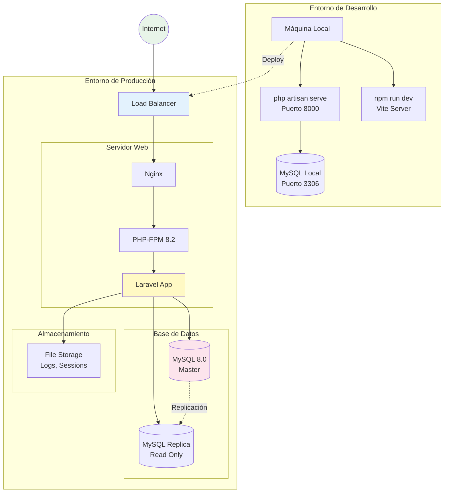
```mermaid
graph TB
    subgraph "Entorno de Desarrollo"
        DevMachine[Máquina Local]
        DevServer[php artisan serve<br/>Puerto 8000]
        DevDB[(MySQL Local<br/>Puerto 3306)]
        DevNode[npm run dev<br/>Vite Server]
        
        DevMachine --> DevServer
        DevMachine --> DevNode
        DevServer --> DevDB
    end

    subgraph "Entorno de Producción"
        LoadBalancer[Load Balancer]
        
        subgraph "Servidor Web"
            Nginx2[Nginx]
            PHP[PHP-FPM 8.2]
            Laravel[Laravel App]
        end
        
        subgraph "Base de Datos"
            ProdDB[(MySQL 8.0<br/>Master)]
            Replica[(MySQL Replica<br/>Read Only)]
        end
        
        subgraph "Almacenamiento"
            Storage[File Storage<br/>Logs, Sessions]
        end
        
        LoadBalancer --> Nginx2
        Nginx2 --> PHP
        PHP --> Laravel
        Laravel --> ProdDB
        Laravel --> Replica
        Laravel --> Storage
        ProdDB -.Replicación.-> Replica
    end

    Internet((Internet)) --> LoadBalancer
    DevMachine -.Deploy.-> LoadBalancer

    style Internet fill:#E8F5E9
    style LoadBalancer fill:#E3F2FD
    style Laravel fill:#FFF9C4
    style ProdDB fill:#FCE4EC
```

---

## 8. Diagrama de Casos de Uso

```mermaid
graph TB
    subgraph Sistema BiblioTech
        UC1[Gestionar Libros]
        UC2[Gestionar Préstamos]
        UC3[Gestionar Usuarios]
        UC4[Ver Estadísticas]
        UC5[Buscar Libros]
        UC6[Ver Mis Préstamos]
        UC7[Renovar Préstamo]
        UC8[Devolver Libro]
    end

    Admin((Administrador))
    Librarian((Bibliotecario))
    Member((Miembro))

    Admin --> UC1
    Admin --> UC2
    Admin --> UC3
    Admin --> UC4
    Admin --> UC5

    Librarian --> UC1
    Librarian --> UC2
    Librarian --> UC4
    Librarian --> UC5
    Librarian --> UC8

    Member --> UC5
    Member --> UC6
    Member --> UC7

    UC2 -.include.-> UC8
    UC2 -.include.-> UC7

    style Admin fill:#FFB6C6
    style Librarian fill:#87CEEB
    style Member fill:#90EE90
```

---

## 9. Leyenda de Colores

```mermaid
graph LR
    Start([Inicio/Fin]) 
    Process[Proceso]
    Decision{Decisión}
    Error[Error]
    Success[Estado exitoso]
    Database[(Base de Datos)]

    style Start fill:#90EE90
    style Process fill:#87CEEB
    style Decision fill:#FFE4B5
    style Error fill:#FFB6C6
    style Success fill:#E8F5E9
    style Database fill:#FCE4EC
```

| Color | Significado | Uso |
|-------|-------------|-----|
| 🟢 Verde claro | Inicio/Fin | Nodos de inicio y terminación |
| 🔵 Azul claro | Proceso/Acción | Operaciones y transformaciones |
| 🟡 Amarillo claro | Decisión | Puntos de bifurcación |
| 🔴 Rosa | Error | Estados de error o fallo |
| 🟣 Verde pálido | Éxito | Estados exitosos |
| 🟪 Morado claro | Base de Datos | Operaciones de persistencia |

---

  
<strong>Diagramas BiblioTech v1.0</strong>

  
Todos los diagramas se renderizan automáticamente en GitHub

  
© 2024 - Guillen Cristofer

